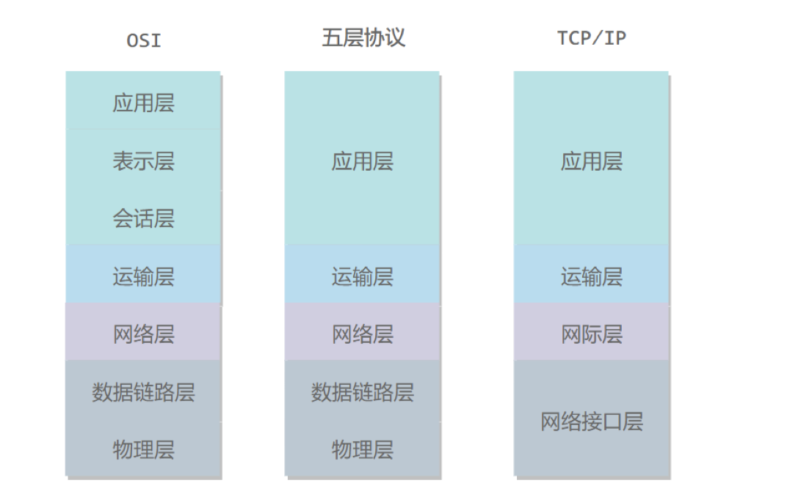
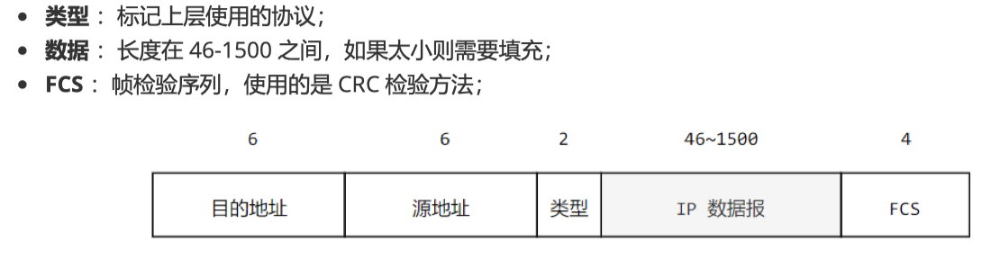
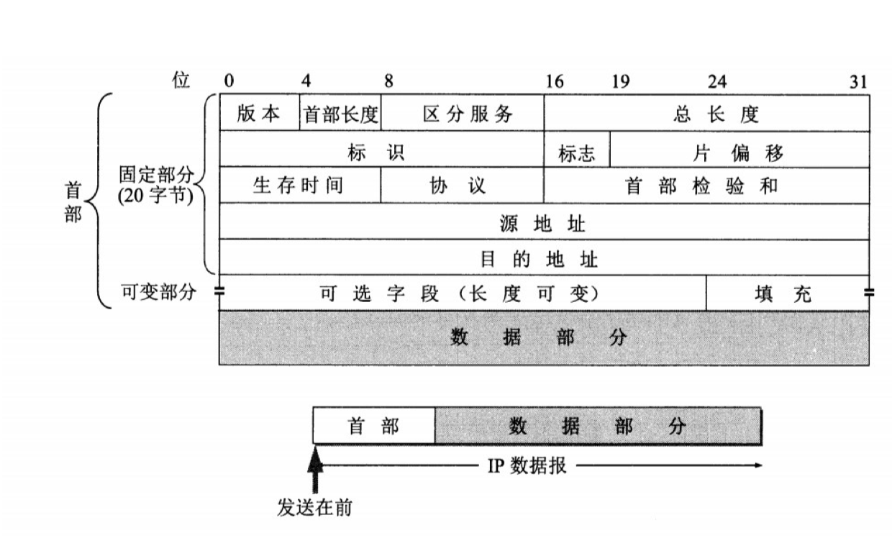
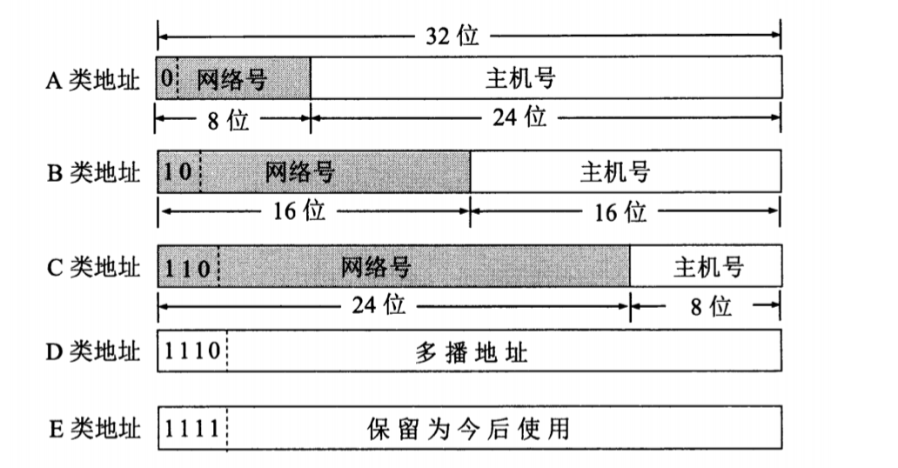
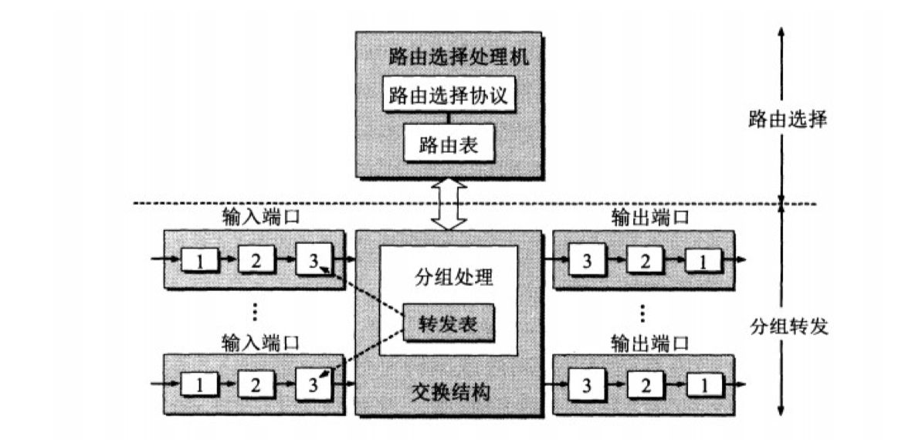
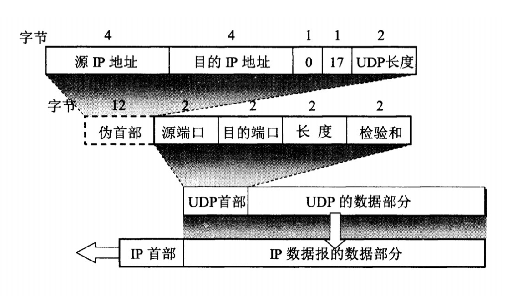
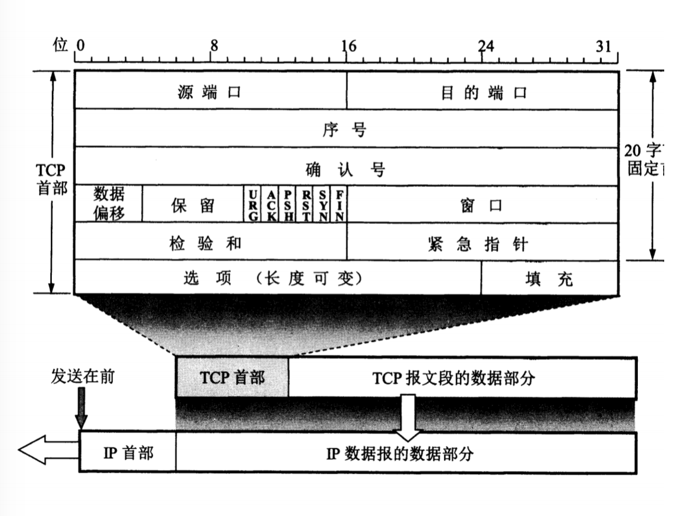
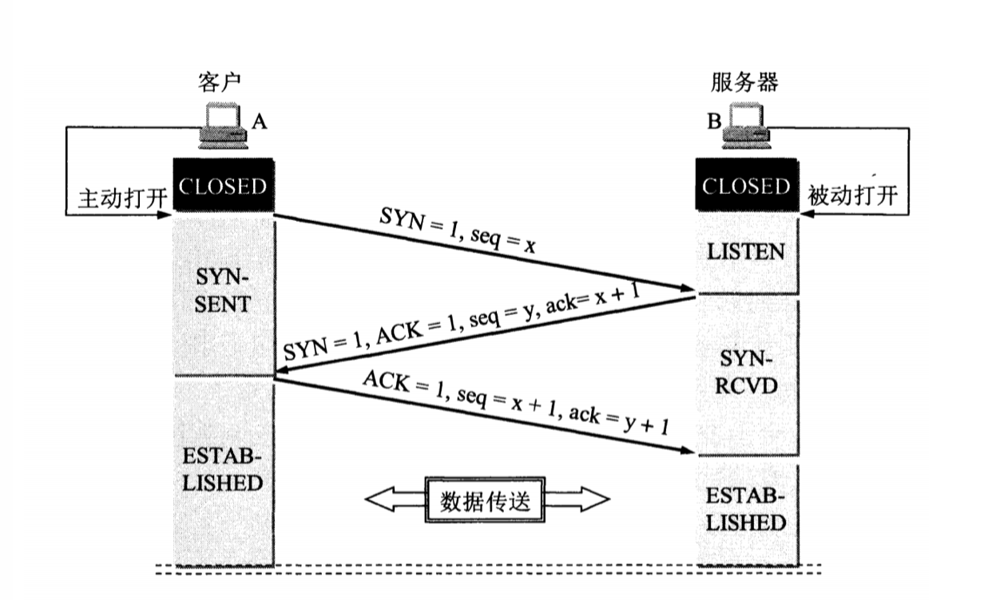
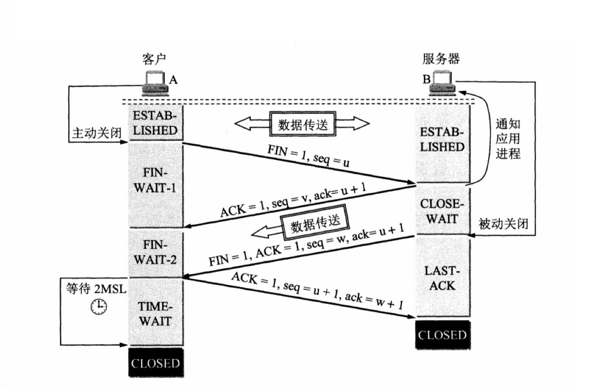
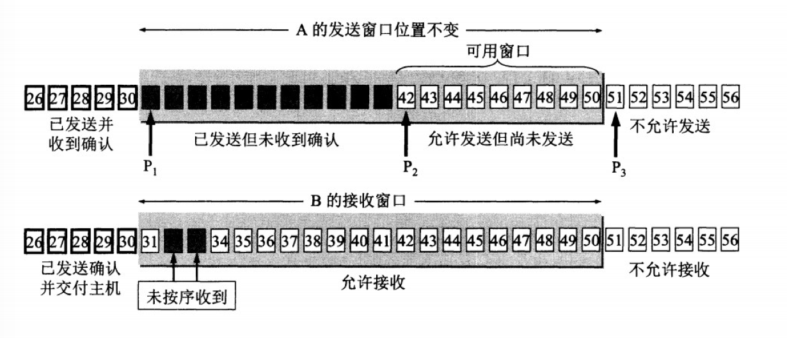

#### ISP 

互联网网络提供商 从互联网管理机构获取IP地址
#### 主机间通信
1.C/S
2.P2P

#### 电路交换与分组交换
1.电路 专用物理链路，通信过程始终占用，利用率低。如电话
2，报文交换
2.分组交换 存储转发 分组包含首部尾部，源地址目的地址，可多链路同时传输多个分组

#### 时延
排队时延+处理时延+传输时延+传播时延
排队：分组在路由器的输入和输出队列中排队等待的时间，取决于网络当前的通信量
处理：主机或路由器收到分组后进行处理（如分析首部，从分组提取数据，差错检测，负载均衡）
传输：主机或路由器传输数据帧所需要的时间。t=l/v l为长度，v为速率
传播：物理信道中传播

#### 体系结构

物理层：怎样在传输媒体上传输比特流(不是指具体的传输媒体)，屏蔽传输媒体差异
数据链路层：为同一个链路的主机提供数据传输服务。数据帧
网络层：为主机提供数据传输服务。分组
传输层：为进城提供通用数据传输服务。TCP报文段，完整性服务，UDP：用户数据报，即时性服务
会话层：建立及管理会话
表示层：数据压缩，加密等数据格式
应用层

### 物理层
#### 通信方式
单工通信
半双工通信
全双工通信
#### 带通调制
数字信号(离散)->模拟信号(连续)

### 链路层
#### 基本作用
1.封装成帧
IP分组加首部尾部，标志帧开始和结束
2.透明传输
判定帧开始和结束，并使用户察觉不到转义字符的存在
转义字符，零比特填充，特殊信号编码
3.差错检测
循环冗余

#### 信道分类
1.广播信道：一对多，所有的节点在同i个广播信道上发送数据 冲突避免
(1)信道复用
频分复用（不同主机不同频） 
时分复用（不同时间占用相同频率带宽）
此两中主机闲置也会占用一部分信道资源
统计时分复用：不固定每个用户在时分复用帧中的位置
波分复用 光的频分复用
码分复用：
1. 每个站点指定唯一的m位芯片序列(1表示为+1，0表示为-1)
2. 发送1时发送序列，0时发送该序列反码
3. 多站点同时发送时，各站点发送数据和对应芯片序列相互正交再发送
4. 合并：各路数据在信道中线性相加
5. 分离时：合并的数据和源站规格化内积
(2)CSMA/CD协议
多点接入：总线型网络
载波监听：每个主机不停监听信道，监听到正在使用，则等待
碰撞检测：发送中，监听到其他主机在发送，发生碰撞 2𝞃争用期(端到端传播时延)
二进制指数退避算法：随机取一个数r，以r𝞃时间等待重传

2.点对点 
PPP协议：用户与ISP进行通信
差错检测 FCS MTU
LCP链路控制协议->NCP网络控制协议（多个不同网络协议，每个网络层协议配置一个NCP为网络层配置网络连接
HDLC：比特 0比特插入透明传输）编号确认机制可靠

#### MAC地址
链路层地址 6字节 为宜标识网卡
#### 局域网
广播信道 一个单位所有
以太网 令牌环网 FDDI ATM
星型环形总线
##### 以太网
星型 局域网
集线器 作用于比特 会碰撞
交换机 不会碰撞 MAC地址存储转发

##### 交换机
自学习能力 交换表 存储MAC地址到接口的映射 即插即用 不用配置
##### 虚拟局域网
VLAN 同一个广播域

### 网络层
互联网核心 尽可能简单 向上提供简单灵活的，无连接的，尽最大努力交互的数据报服务
IP协议 统一异构物理网络
地址解析协议ARP
网际控制报文协议 ICMP
网际组管理协议 IGMP
#### IP数据报格式

首部长度：1代表4个字节，固定部分长度为5字节，该值最小为5
总长度：包括首部和数据部分
标识：用于分片
标志：
片偏移：和标识符一起用于分片，单位为8个字节
生存时间：TTL，为0的丢弃，防止兜圈子
协议：之处携带的数据给哪个协议处理
首部检验和：数据报每经过一个路由器都需要检验，检验和不包括数据部分，减少计算工作量

#### IP地址编址方式
##### 分类
网络号+主机号

##### 子网划分
主机号字段中拿一部分作为子网号
IP = 网络号 + 子网号 +主机号
子网掩码
B类子网掩码：255.255.192.0(两位子网号)
##### 无分类编址CIdr
IP = 网络前缀+主机号
128.14.35.7/20表示前20位位网络前缀
子网掩码首1长度为网络前缀的长度
路由聚合--构成超网 
路由器 最长前缀匹配
#### 地址解析协议ARP
网络层通信。IP不变，MAC随着链路改变
ARP：IP->MAC
已知IP地址，发送广播ARP请求分组-->ARP响应
#### ICMP
封装在IP数据报中
1.种类
差错报告报文
询问报文
##### PIng
测试连通性
向目的主机发送ICMP Echo请求报文，目的主机收到后发送Echo回答报文，Ping根据时间和成功响应的次数估计出数据包往返时间以及丢包率
##### Traceroute
跟踪分组从源点到终点的路径
IP数据封装的是UDP数据报 目的主机发送ICMP终点不可达差错报告报文
源主机分别发送TTL为1，2，3，。。。的报文，中间路由器收到后分别返回终点不可达报文，从而源主机知道到达目的主机所经过的路由器IP地址以及达到每个路由器的往返时间
#### 虚拟专用网VPN
10.0.0.0 ～ 10.255.255.255
172.16.0.0 ～ 172.31.255.255
192.168.0.0 ～ 192.168.255.255

主机X(10.1.0.1) -- 场所A(10.1.0.0) -- 路由器R1(125.1.2.3)----（隧道）路由器R2(194.4.5.6)--场所B(10.2.0.0) -- 主机Y(10.2.0.3)
#### 网络地址转换 NAT
将本地IP ---> 全球IP
出：源IP地址 + TCP源端口
入：目的IP地址 + TCP目的端口
#### 路由器结构
路由选择 
分组转发 交换结构 一组输入端口 一组输出端口

##### 分组转发流程
数据报首部提取目的主机IP地址D，等到目的网络地址N
N与路由器直接相连---直接交付
路由表中有D的特定路由，传送给表指定的路由器
表中有N的制定路由
表中有默认路由
报告转发分组出错
#### 路由选择协议
自适应 随网络通信量和拓扑结构的变化而自适应调整
互联网可分为若干自治系统AS，可使用自己的路由选择协议
自治系统内部：RIP OSPF
自治系统间：BGP
##### 内部网关协议RIP
基于距离向量的路由选择协议 距离指跳数 最多为15
RIP按固定的时间间隔和相邻路由器交换路由表，若干次后，路由器最终知道到达本自治系统中任何一个网络的最短距离和下一跳路由器地址
**距离向量算法RIP**
1.对地址为X的相邻路由器发来的RIP报文，先将报文中所有下一跳字段的地址改为X，距离字段加1
2.对于每一项：
    目的地址N原路由器中没有，添加；
    否则：下一跳地址为X，更新；
         否则：收到项目中的距离小于表中距离：更新
               否则：保持原样
3.3分钟没有收到相邻路由器的更新路由表，视为不可达，距离置为16(限制规模)
pro：网络故障时消息传送慢
**内部网关协议OSPF**
DIjkstra算法

1. 泛洪法 自治系统内所有路由器发送信息
2. 发送与相邻路由器的链路状态(与哪些路由器相邻，链路度量，距离，时延。。。)
3. 链路变化时，才发送

所有路由器有全网拓扑结构图，且一致--->收敛快
**外部网关协议BGP**
选择较好路由
AS(BGP代言人) ---TCP--- (BGP代言人)AS
### 传输层
提供进程间逻辑通信
#### UDP和TCP
UDP(用户数据报协议)：无连接，最大可能交付，无拥塞控制，面向报文(应用层下来的报文只添加UDP首部)，支持一对一，一对多，多对一，多对多
TCP(传输控制协议)：面向连接，可靠交付，流量控制，拥塞控制，全双工通信，面向字节流(应用层下来数据看成字节流，组织称大小不等数据块)，点对点(一对一通信)
##### UDP首部

8个字节，源端口，目的端口，长度，检验和，12个字节伪首部(计算检验和临时添加)

##### TCP首部

序号：字节流编号，第一个自己编号301，带100个字节，下一个报文段序号为401
确认号：期望收到的下一个报文段的序号
数据偏移：即首部长度
确认ACK：为1时有效
同步SYN：连接建立时用于同步序号
SYN=1，ACK=0 连接请求报文段；SYN=1，ACK=1 响应报文段
终止FIN：释放连接，FIN=1
窗口：接收方让发送方设置其发送窗口

#### TCP三次握手

原因：防止实效的连接请求达到服务器
一个请求在网络中滞留时，客户端收不到连接确认重新请求，连接建立--->前一个请求达到服务器，没有第三次握手会建立两个连接

#### TCP四次挥手

四次挥手原因：让服务器端发送还未传送完毕的数据
**TIME_WAIT**
1.确保最后一个确认报文能够达到。若服务器没有收到会重新发送连接释放请求报文
2.让本连接时间段内的所有报文都从网络中消失

#### 可靠传输
超时重传：发送到接收确认时间：RTT
RTTs = (1-a)* RTTs + a * RTT
0≤a<1 a↑  对RTTs影响↑
#### 滑动窗口
用于暂时存放字节流

接收窗口只对窗口内最后一个**按序**到达的字节进行确认。如图只对31号字节确认，代表该字节以前的所有字节已经被接收。

#### TCP流量控制
控制发送方速率，保证接收方来得及接收
接收方确认报文窗口字段 --- 控制发送方窗口大小，影响发送方发送速率
#### TCP拥塞控制
控制发送方发送速率，降级整个网络的拥塞程度
拥塞窗口(cwnd)，状态变量，实际决定发送多少数据的是发送方窗口
1.慢开始与拥塞避免
cwnd=1
收到确认，cwnd=2（每收到一个确认，新发送一个报文段）
4，8...直至慢开始门限ssthresh
cwnd >= ssthresh ,拥塞避免，cwnd每次加1
出现超时，ssthresh = cwnd/2，重新开始慢开始
2.快重传与快恢复

丢失个别报文段---快恢复 ssthresh = cwnd/2,cwnd = ssthresh，直接进入拥塞避免

### 应用层

#### 域名系统

DNS：主机名 --- IP地址
分布式数据库 每个站点只保留自己的部分数据
层次结构：根域名. 顶级域名(edu gov com net) 二级域名(nsu mit google)

UDP 53：多数情况，要求域名解析器和服务器自己处理超时和重传保证可靠性)
TCP 53 ：
1.返回响应超过512(UDP最大支持512)
2.区域传送(主域名服务器--->辅助域名服务器 传送变化数据)

#### 文件传送协议FTP

TCP连接
控制连接：服务器打开21等待，客户端主动连接--->只用连接传送命令--->传回服务器应答
数据连接：20传送文件数据
主动模式：服务器主动建立数据连接，s端口20，c端口随机>1024（0-1023为熟知端口号）
要求客户端开放端口号，需配置客户端防火墙
被动模式：客户端主动建立，客户端端口自己指定，服务器端口随机
只需服务器端开放端口号，开放过大安全性减弱

#### 动态主机配置协议DHCP

即插即用 自动配置IP，子网掩码，网关IP
DIscover报文: UDP
目的地址:255.255.255.255：67
源地址:0.0.0.0:68 
广播到子网所有主机(客户端与DHCP服务器不在一个子网，中继器)

#### 远程登录协议telnet

登录远程主机，远程主机输出也会返回；适应不同操作系统差异

#### 电子邮件协议

用户代理，邮件服务器，邮件协议(发送协议SMTP，读取协议POP3，IMAP)

1. SMTP

   SMTP只能发ASCII码--->互联网邮件扩充MIME，可发送二进制文件，定义非ASCII编码规则

   

2. POP3

   用户从服务器读取邮件--->服务器删除

3. IMAP

   客户端和服务器邮件保持同步
   手动删除才会删除--->用户可随时访问服务器邮件

#### 常用端口

| **应用**         | **应用层协议** | **端口号** | **传输层协议** | **备注**               |
| ---------------- | -------------- | ---------- | -------------- | ---------------------- |
| 域名解析         | DNS            | 53         | UDP/TCP        | 长度超过512字节时用TCP |
| 动态主机配置协议 | DHCP           | 67/68      | UDP            |                        |
| 简单网络管理协议 | SNMP           | 161/162    | UDP            |                        |
| 文件传送协议     | FTP            | 21/20      | TCP            | 控制连接21，数据连接20 |
| 远程终端协议     | TELNET         | 23         | TCP            |                        |
| 超文本传输协议   | HTTP           | 80         | TCP            |                        |
| 简单邮件传送协议 | SMTP           | 25         | TCP            |                        |
| 邮件读取协议     | POP3           | 110        | TCP            |                        |
| 网际报文存取协议 | IMAP           | 143        | TCP            |                        |

#### Web页面请求过程

##### DHCP配置主机信息

1. 主机没有IP地址，需先使用DHCP获取
2. 主机生成DHCP请求报文，将报文放入目的端口为67，源端口为68分的UDP报文段
3. IP数据报封装：目的地址为广播IP地址255.255.255.255，源为0
4. MAC帧：目的地址为FF::FF，广播到与交换机连接的所有设备
5. 与交换机连接DHCP服务器，收到广播帧，分解得DHCP报文，生成DHCP ACK报文，包含：IP地址，DNS服务器IP，默认网关路由器IP，子网掩码。封装UDP报文段-->IP数据报--MAC帧
6. 该帧的目的地址是请求主机的MAC地址，交换机自学习后直接向特定接口发送帧
7. 主机收到后，配置IP地址，子网掩码，DNS服务器IP地址，在IP转发表中安装默认网关

##### ARP解析MAC地址

1. 主机通过浏览器生成TCP套接字--->向HTTP服务器发送HTTP请求。生成该套接字需要知道网站域名对应地址
2. 主机生成DNS查询报文，具有53端口
3. 封装，IP数据报(具有DNS服务器IP)，以太网帧--->发往网关路由器
4. DHCP时只知道网关路由器的IP地址--->ARP协议获取MAC地址
5. 主机生成目的地址为网关路由器IP地址的ARP查询报文，该报文峰状如有广播地址的以太网帧--->交换机将该帧转发给所有连接设备
6. 网关路由器收到该帧，分解得到ARP报文，发现IP地址匹配，发送ARP回答报文(包含MAC地址)

##### DNS解析域名

1. 网关路由器收到包含DNS查询的以太网帧，抽取出IP数据包，进行路由选择
2. 路由器内部网关协议RIP,OSPF和外部网关协议BGP，配置了网关路由器达到DNS服务器的路由选项
3. 达到DNS服务器，抽取DNS查询报文，查找待解析域名
4. 找到后发送DNS回答报文，放入UDP报文段--->路由器--->网关路由器--->主机

##### HTTP请求页面

1. 主机有HTTP服务器的IP--->与HTTP服务器三次握手建立连接
2. 生成并发送目的端口为80的TCP SYN报文段
3. HTTP服务器收到，生成TCP SYN ACK报文段发回
4. 连接建立后，浏览器生成HTTP GET报文
5. HTTP服务器生成HTTP响应报文，将Web页面放入报文主体
6. 浏览器收到响应报文，抽取Web页面，渲染，显示。